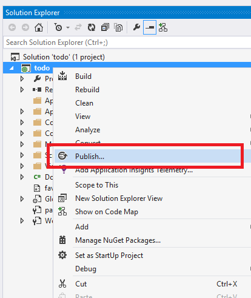
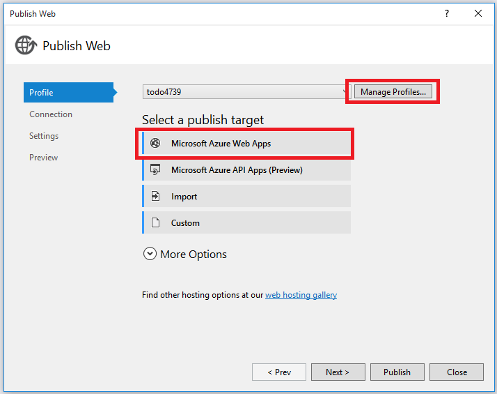
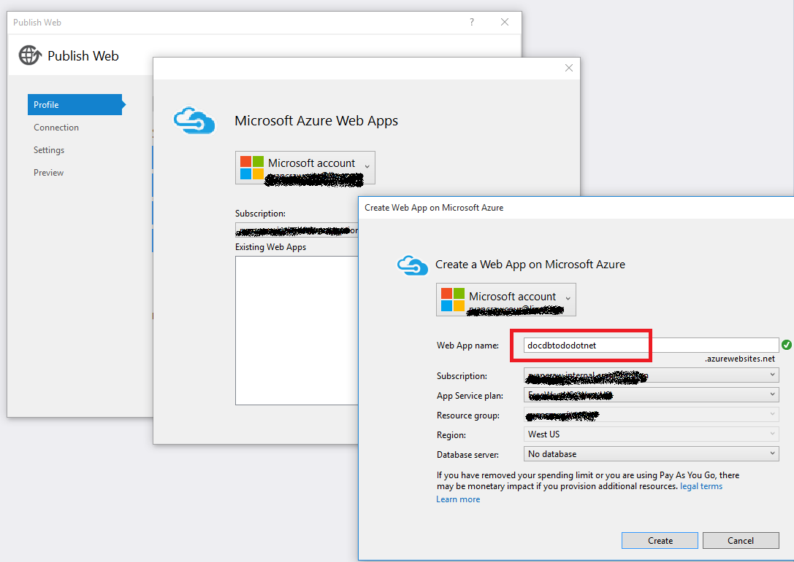
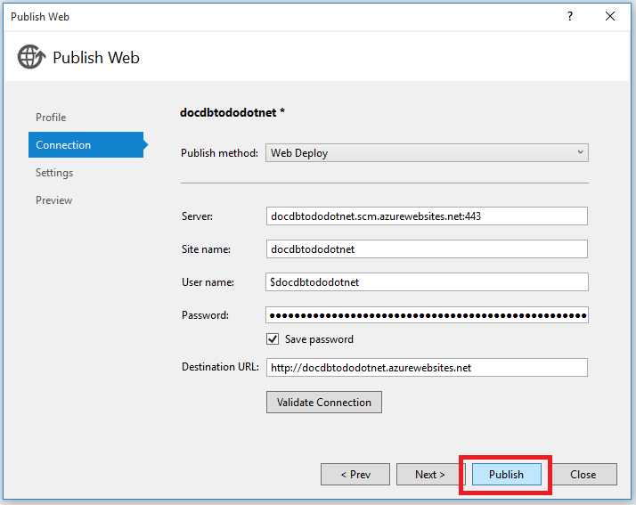

# Web application development with ASP.NET MVC using DocumentDB
This sample shows you how to use the Microsoft Azure DocumentDB service to store and access data from an ASP.NET MVC application hosted on Azure Websites. 

For a complete end-to-end walk-through of creating this application, please the [full tutorial on the Azure documentation page](https://azure.microsoft.com/en-us/documentation/articles/documentdb-dotnet-application/)

## Running this sample

1. Before you can run this sample, you must have the following perquisites:
	- An active Azure DocumentDB account - If you don't have an account, refer to the [Create a DocumentDB account](https://azure.microsoft.com/en-us/documentation/articles/documentdb-create-account/) article.
	- Visual Studio 2013 (or higher).
	- [Azure SDK for Visual Studio 2013](https://azure.microsoft.com/en-us/downloads/)

2.Clone this repository using Git for Windows (http://www.git-scm.com/), or download the zip file.

3.From Visual Studio, open the **todo.sln** file from the root directory.

4.In Visaul Studio Build menu, select **Build Solution** (or Press F6). 

5.Retrieve the URI and PRIMARY KEY (or SECONDARY KEY) values from the Keys blade of your DocumentDB account in the Azure Preview portal. For more information on obtaining endpoint & keys for your DocumentDB account refer to [How to manage a DocumentDB account](https://azure.microsoft.com/en-us/documentation/articles/documentdb-manage-account/#keys)

If you don't have an account, see [Create a DocumentDB database account](https://azure.microsoft.com/en-us/documentation/articles/documentdb-create-account/) to set one up.

6.In the **Web.config** file, located in the project root, find and update the default values for **endpoint** and **authKey** and replace the placeholder values with the values obtained for your account.

	<add key="endpoint" value="~enter URI for your DocumentDB Account, from Azure Preview portal~" /> 
	<add key="authKey" value="~enter either Primary or Secondary key for your DocumentDB Account, from Azure Preview portal~" /> 

7.You can now run and debug the application locally by pressing **F5** in Visual Studio.

## Deploy this sample to Azure

1. In Visual Studio Solution Explorer, right-click on the project name and select **Publish...**

2. Using the Publish Website dialog, select **Microsoft Azure Web Apps**
3. 

3. In the next dialog, either select an existing web app, or follow the prompts to create a new web application. Note: If you choose to create a web application, the Web App Name chosen must be globally unique. 

 
4. Once you have selected the web app, click **Publish**

5. After a short time, Visual Studio will complete the deployment and open a browser with your deployed application. 

For additional ways to deploy this web application to Azure, please refer to the [Deploy a web app in Azure App Service](https://azure.microsoft.com/en-us/documentation/articles/web-sites-deploy/) article which includes information on using Azure Resource Manager (ARM) Templates, Git, MsBuild, PowerShell, Web Deploy, and many more. 

## About the code
The code included in this sample is intended to get you going with a simple ASP.NET MVC application that connects to Azure DocumentDB. It is not intended to be a set of best practices on how to build scalable enterprise grade web applications. This is beyond the scope of this quick start sample. 

## More information

- [Azure DocumentDB Documentation](https://azure.microsoft.com/en-us/documentation/services/documentdb/)
- [Azure DocumentDB .NET SDK](https://www.nuget.org/packages/Microsoft.Azure.DocumentDB/)
- [Azure DocumentDB .NET SDK Reference Documentation](https://msdn.microsoft.com/library/azure/dn948556.aspx) 